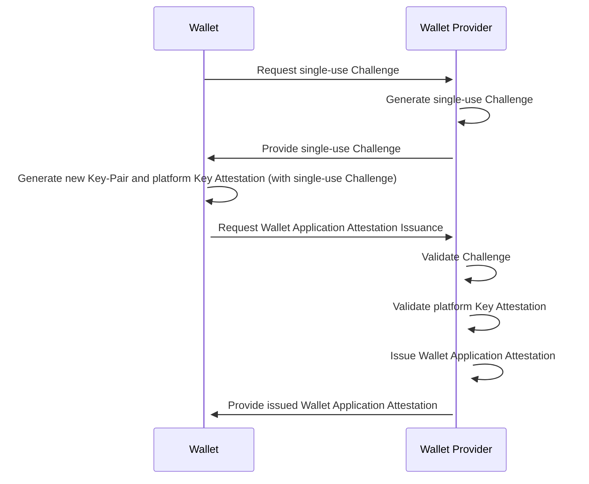
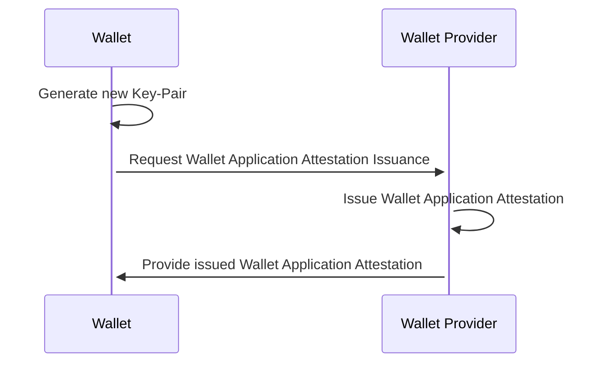

# Wallet Provider

**Important!** Before you proceed, please read
the [EUDI Wallet Reference Implementation project description](https://github.com/eu-digital-identity-wallet/.github/blob/main/profile/reference-implementation.md)

* [Overview](#overview)
* [Disclaimer](#disclaimer)
* [Features](#features)
* [Technical Details](#technical-details)
* [Endpoints](#endpoints)
* [Deployment](#deployment)
* [How to contribute](#how-to-contribute)
* [License](#license)

## Overview

An implementation of a Wallet Provider service according to [OpenId4VCI 1.0](https://openid.net/specs/openid-4-verifiable-credential-issuance-1_0.html), 
and [EUDI Wallet Standards and Technical Specifications](https://github.com/eu-digital-identity-wallet/eudi-doc-standards-and-technical-specifications).

> [!IMPORTANT]  
> Wallet Provider is created strictly for testing and development purposes.   
> By default, Wallet Provider acts as a **_MOCK_** Wallet Provider service, performing **_NO_** validations of platform Key Attestations 
> provided by Wallets, issuing Attestations with **_NO_** further checks.    
> Wallet Provider can be **_OPTIONALLY_** configured to perform validations of platform Key Attestations provided by Wallets, using the 
> [Warden Server-Side Mobile Client Attestation Library](https://github.com/a-sit-plus/warden).

## Disclaimer

> [!CAUTION]  
> Wallet Provider is created strictly for testing and development purposes. It is **_NOT_** production-grade.  
> Wallet Provider is provided on an as-is basis, without warranties or conditions of any kind, either express or implied.

The released software is an initial development release version:

* The initial development release is an early endeavor reflecting the efforts of a short timeboxed period, and by no means can it be considered 
as the final product.
* The initial development release may be changed substantially over time, might introduce new features but also may change or remove existing 
ones, potentially breaking compatibility with your existing code.
* The initial development release is limited in functional scope.
* The initial development release may contain errors or design flaws and other problems that could cause system or other failures and data loss.
* The initial development release has reduced security, privacy, availability, and reliability standards relative to future releases. This could 
make the software slower, less reliable, or more vulnerable to attacks than mature software.
* The initial development release is not yet comprehensively documented.
* Users of the software must perform sufficient engineering and additional testing to properly evaluate their application and determine whether 
any of the open-sourced components is suitable for use in that application.
* We strongly recommend against putting this version of the software into production use.
* Only the latest version of the software will be supported

## Features

The service supports issuance of:

1. Key-bound Wallet Application Attestations
2. Wallet Unit Attestations

per [Specification of Wallet Unit Attestations (WUA) used in issuance of PID and Attestations](https://github.com/eu-digital-identity-wallet/eudi-doc-standards-and-technical-specifications/blob/main/docs/technical-specifications/ts3-wallet-unit-attestation.md).

The following deviations apply:

1. Wallet Unit Attestations do not use any revocation mechanism

### Issuance of key-bound Wallet Application Attestation

#### Issuance using platform Key Attestation

To issue a Wallet Application Attestation:

1. The Wallet requests a single-use Challenge from the Wallet Provider
2. The Wallet generates a new Key-Pair and platform Key Attestation which contains the single-use Challenge provided by the Wallet Provider
3. The Wallet requests a key-bound Wallet Application Attestation from the Wallet Provider
4. The Wallet Provider:
   1. Validates the single-use Challenge
   2. Validates the platform Key Attestation
   3. Verifies the platform Key Attestation contains the single-use Challenge
   4. Issues a key-bound Wallet Application Attestation

#### Issuance using Json Web Key

> [!CAUTION]  
> When using a Json Web Key, Wallet Provider performs **NO** validations and simply issues a key-bound Wallet Application Attestation 
> using the provided Json Web Key.  

To issue a Wallet Application Attestation:

1. The Wallet generates a new Key-Pair
2. The Wallet requests a key-bound Wallet Application Attestation from the Wallet Provider
3. The Wallet Provider issues a key-bound Wallet Application Attestation

### Issuance of Wallet Unit Attestation

#### Issuance using platform Key Attestations

To issue a Wallet Unit Attestation:

1. The Wallet requests a single-use Challenge from the Wallet Provider
2. The Wallet generates new Key-Pairs and platform Key Attestations which contain the single-use Challenge provided by the Wallet Provider
3. The Wallet requests a Wallet Unit Attestation from the Wallet Provider
4. The Wallet Provider:
    1. Validates the single-use Challenge
    2. Validates the platform Key Attestations
    3. Verifies the platform Key Attestations contain the single-use Challenge
    4. Issues Wallet Unit Attestation

#### Issuance using Json Web Key Set

> [!CAUTION]  
> When using a Json Web Key Set, Wallet Provider performs **NO** validations and simply issues a Wallet Unit Attestation
> using the provided Json Web Key Set.

To issue a Wallet Unit Attestation:

1. The Wallet generates new Key-Pairs
2. The Wallet requests a Wallet Unit Attestation from the Wallet Provider
3. The Wallet Provider issues a Wallet Unit Attestation

## Technical Details

Wallet Provider uses the [Warden Server-Side Mobile Client Attestation Library](https://github.com/a-sit-plus/warden) for validating platform Key Attestations.
Android Wallets must use the [Certification Chain provided by the Android Keystore](https://developer.android.com/privacy-and-security/security-key-attestation).
iOS Wallets must use the [Supreme Attestation Format](https://github.com/a-sit-plus/warden?tab=readme-ov-file#ios) which is based on [Apple's App Attest Service](https://developer.apple.com/documentation/devicecheck/establishing-your-app-s-integrity).

## Endpoints

An OpenAPI specification of the endpoints provided by Wallet Provider is available [here](openapi/openapi.json).

## Deployment

Wallet Provider can be deployed using Docker or any other OCI compliant container runtime. You can find the available container images 
[here](https://github.com/eu-digital-identity-wallet/eudi-srv-wallet-provider/pkgs/container/eudi-srv-wallet-provider).

### Configuration

Wallet Provider can be configured using the following environment variables:

#### Server configuration

Variable: `SERVER_PORT`  
Description: Port the HTTP listener of Wallet Provider will bind to.  
Default value: `8080`  

Variable: `SERVER_PREWAIT`  
Description: Period after which the shutdown process begins.  
Default value: `30 seconds`  

Variable: `SERVER_GRACE`  
Description: Period during which already in-flight requests are allowed to continue before the shutdown process begins.  
Default value: `5 seconds`  

Variable: `SERVER_TIMEOUT`  
Description: Period after which the server forcibly shuts down.  
Default value: `5 seconds`  

#### Attestation Signing Key Configuration

By default, Wallet Provider uses an ephemeral EC Key on the `secp256r1` curve to sign Attestations using the `ECDSAwithSHA256` algorithm.

To load a signing key and certificate from a Keystore, use the following environment variables:

Variable: `SIGNINGKEY_KEYSTOREFILE`  
Description: Location of the Keystore.  
Default value: N/A  

Variable: `SIGNINGKEY_KEYSTOREPASSWORD`  
Description: Password of the Keystore.  
Default value: N/A  

Variable: `SIGNINGKEY_KEYSTORETYPE`  
Description: Type of the Keystore.  
Default value: `JKS`  

Variable: `SIGNINGKEY_KEYALIAS`  
Description: Alias of the Key and Certificate Chain to load.  
Default value: N/A  

Variable: `SIGNINGKEY_KEYPASSWORD`   
Description: Password of the Key to load.  
Default value: N/A  

Variable: `SIGNINGKEY_ALGORITHM`   
Description: Algorithm used to sign the generated Attestations.  
Default value: N/A  
Allowed values:
* `ECDSAwithSHA256`
* `ECDSAwithSHA384`
* `ECDSAwithSHA512`
* `RSAwithSHA256andPKCS1Padding`
* `RSAwithSHA384andPKCS1Padding`
* `RSAwithSHA512andPKCS1Padding`
* `RSAwithSHA256andPSSPadding`
* `RSAwithSHA384andPSSPadding`
* `RSAwithSHA512andPSSPadding`

#### Platform Key Attestation Validation Configuration

By default, Wallet Provider performs no validation of platform Key Attestations.

To enable platform Key Attestation validation, use the following environment variables:

> [!NOTE]  
> Due to limitations of the [Warden Server-Side Mobile Client Attestation Library](https://github.com/a-sit-plus/warden), when enabling Key Attestation
validation, you must configure both Android and iOS Key Attestation validation.

#### Android Key Attestations

Variable: `PLATFORMKEYATTESTATIONVALIDATION_ANDROID_APPLICATIONS_XX_PACKAGENAME`   
Description: Android Package of the Wallet.  
Default value: N/A  

Variable: `PLATFORMKEYATTESTATIONVALIDATION_ANDROID_APPLICATIONS_XX_SIGNINGCERTIFICATEDIGESTS_XX`   
Description: Base64 Url-Safe encoded DER encoding of the X509 Certificate used to sign the Wallet application.  
Default value: N/A  

Variable: `PLATFORMKEYATTESTATIONVALIDATION_ANDROID_STRONGBOXREQUIRED`   
Description: Whether StrongBox security leve is required.  
Default value: `false`  

Variable: `PLATFORMKEYATTESTATIONVALIDATION_ANDROID_UNLOCKEDBOOTLOADERALLOWED`  
Description: Whether devices with unlocked bootloaders are allowed.  
Default value: `false`  

Variable: `PLATFORMKEYATTESTATIONVALIDATION_ANDROID_ROLLBACKRESISTANCEREQUIRED`  
Description: Whether rollback resistance is required.  
Default value: `false`  

Variable: `PLATFORMKEYATTESTATIONVALIDATION_ANDROID_LEAFCERTIFICATEVALIDITYIGNORED`  
Description: Whether the validity of the leaf certificate is ignored.  
Default value: `false`  

Variable: `PLATFORMKEYATTESTATIONVALIDATION_ANDROID_VERIFICATIONSKEW`  
Description: Tolerance added to the verification date.  
Default value: `0 seconds`  

Variable: `PLATFORMKEYATTESTATIONVALIDATION_ANDROID_HARDWAREATTESTATIONENABLED`  
Description: Whether **hardware** Key Attestations are accepted.  
Default value: `true`  

Variable: `PLATFORMKEYATTESTATIONVALIDATION_ANDROID_NOUGATATTESTATIONENABLED`  
Description: Whether Key Attestations generated on Devices with **Android Nougat** are accepted.  
Default value: `false`  

Variable: `PLATFORMKEYATTESTATIONVALIDATION_ANDROID_SOFTWAREATTESTATIONENABLED`  
Description: Whether **software** Key Attestations are accepted.  
Default value: `false`  

**Validity of Key Attestation**

By default, Wallet Provider validates the creation time of the Key Attestation using a default skew of `5 minutes`. You can modify the `skew` using
the following environment variable:

Variable: `PLATFORMKEYATTESTATIONVALIDATION_ANDROID_ATTESTATIONSTATEMENTVALIDITY_SKEW`  
Description: How far in the past, the creation date of a Key Attestation can be.  
Default value: `5 minutes`  

To disable this check, set the environment variable `PLATFORMKEYATTESTATIONVALIDATION_ANDROID_ATTESTATIONSTATEMENTVALIDITY` to `Disabled`.

##### iOS Key Attestations

Variable: `PLATFORMKEYATTESTATIONVALIDATION_IOS_APPLICATIONS_XX_TEAMIDENTIFIER`   
Description: The Team Identifier of the Wallet.  
Default value: `N/A`  

Variable: `PLATFORMKEYATTESTATIONVALIDATION_IOS_APPLICATIONS_XX_BUNDLEIDENTIFIER`   
Description: The Bundle Identifier of the Wallet.  
Default value: `N/A`  

Variable: `PLATFORMKEYATTESTATIONVALIDATION_IOS_APPLICATIONS_XX_ENVIRONMENT`    
Description: Environment in which the Wallet is running.  
Default value: `Production`   
Allowed values:
* `Production`
* `Sandbox`

Variable: `PLATFORMKEYATTESTATIONVALIDATION_IOS_ATTESTATIONSTATEMENTVALIDITY_SKEW`  
Description: How far in the past, the creation date of a Key Attestation can be.  
Default value: `5 minutes`  

### Challenge Configuration

Variable: `CHALLENGE_LENGTH`   
Description: The number of bytes a Challenge is composed of.  
Default value: `128`  

Variable: `CHALLENGE_VALIDITY`   
Description: Duration a Challenge is valid for.  
Default value: `5 minutes`  

### Issuer Configuration

Variable: `WALLETAPPLICATIONATTESTATION_ISSUER`  
Description: Issuer of the Attestations.  
Default value: `eudi-srv-wallet-provider`

### Wallet Information Configuration

Variable: `WALLETINFORMATION_GENERALINFORMATION_PROVIDER`  
Description: Name of Wallet Provider, as listed on the Trusted List of Wallet Providers.  
Default value: N/A

Variable: `WALLETINFORMATION_GENERALINFORMATION_ID`  
Description: Identifier of the Wallet Solution, as listed on the Trusted List of Wallet Providers.  
Default value: N/A

Variable: `WALLETINFORMATION_GENERALINFORMATION_VERSION`  
Description: Version of the Wallet Solution.  
Default value: N/A

Variable: `WALLETINFORMATION_GENERALINFORMATION_CERTIFICATION`  
Description: Which conformity assessment body certified the Wallet Solution, the applicable certification number, etc.  
Default value: N/A  

Variable: `WALLETINFORMATION_WALLETSECURECRYPTOGRAPHICDEVICEINFORMATION_TYPE`  
Description: Technical implementation of the WSCD.  
Default value: N/A  
Examples:
* `REMOTE`
* `LOCAL_EXTERNAL`
* `LOCAL_INTERNAL`
* `LOCAL_NATIVE`
* `HYBRID`

Variable: `WALLETINFORMATION_WALLETSECURECRYPTOGRAPHICDEVICEINFORMATION_CERTIFICATION`  
Description: Information about the certification achieved by the WSCD.  
Default value: N/A

### Wallet Application Attestation Configuration

Variable: `WALLETAPPLICATIONATTESTATION_VALIDITY`  
Description: Duration a Wallet Application Attestations is valid for.  
Default value: `24 hours`  
Maximum value: `24 hours`  

Variable: `WALLETAPPLICATIONATTESTATION_WALLETNAME`  
Description: Wallet Name that will be included in the Wallet Application Attestations.  
Default value: N/A  

Variable: `WALLETAPPLICATIONATTESTATION_WALLETLINK`  
Description: Wallet Link that will be included in the Wallet Application Attestations.  
Default value: N/A  

### Wallet Unit Attestation Configuration

Variable: `WALLETAUNITATTESTATION_VALIDITY`  
Description: Duration a Wallet Unit Attestations is valid for.    
Default value: `31 days`  
Minimum value: `31 days`  

Variable: `WALLETUNITATTESTATION_KEYSTORAGE_XX`  
Description: Case sensitive strings that assert the attack potential resistance of the key storage component and its keys attested.  
Default value: N/A  
Examples:
* `iso_18045_high`
* `iso_18045_moderate`
* `iso_18045_enhanced-basic`
* `iso_18045_basic`  

Variable: `WALLETUNITATTESTATION_USERAUTHENTICATION_XX`  
Description: Case sensitive strings that assert the attack potential resistance of the user authentication methods allowed to access the private keys from the attested_keys.  
Default value: N/A  
Examples:
* `iso_18045_high`
* `iso_18045_moderate`
* `iso_18045_enhanced-basic`
* `iso_18045_basic`

Variable: `WALLETUNITATTESTATION_CERTIFICATION`  
Description: URL that links to the certification of the key storage component.  
Default value: N/A

### Duration formats

Duration types support unit strings in the following format (lower case only), with an optional space between the unit value and the unit type.

* `ns`, `nano`, `nanos`, `nanosecond`, `nanoseconds`
* `us`, `micro`, `micros`, `microsecond`, `microseconds`
* `ms`, `milli`, `millis`, `millisecond`, `milliseconds`
* `s`, `second`, `seconds`
* `m`, `minute`, `minutes`
* `h`, `hour`, `hours`
* `d`, `day`, `days`

For example, `10s`, `3 days`, or `12 hours`.

## How to contribute

We welcome contributions to this project. To ensure that the process is smooth for everyone
involved, follow the guidelines found in [CONTRIBUTING.md](CONTRIBUTING.md).

## License

### License details

Copyright (c) 2023 European Commission

Licensed under the Apache License, Version 2.0 (the "License");
you may not use this file except in compliance with the License.
You may obtain a copy of the License at

    http://www.apache.org/licenses/LICENSE-2.0

Unless required by applicable law or agreed to in writing, software
distributed under the License is distributed on an "AS IS" BASIS,
WITHOUT WARRANTIES OR CONDITIONS OF ANY KIND, either express or implied.
See the License for the specific language governing permissions and
limitations under the License.